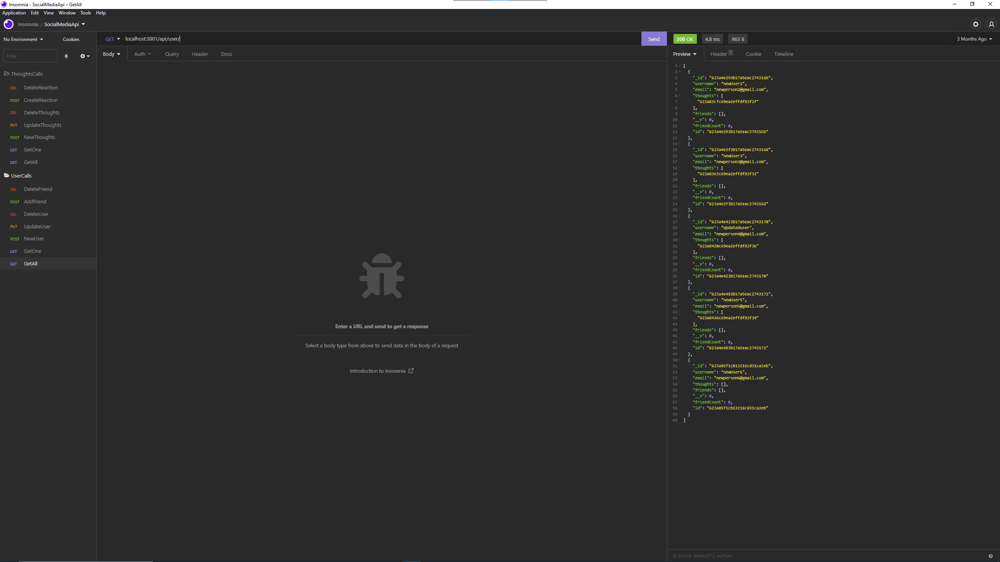

# SocialNetworkAPI 

## Description 
The motivation for this project was to create a sort of backend for a social media application where users can share their thoughts, react to their friends’ thoughts, and create a friend list. The code doesn't solve any inherent problem other than making a more streamlined backend of a supposed social media site. In this project we learned more about NoSQL databases, like MongoDB and the Mongoose ODM. Express was also used and explored more deeply than before. 
## Table of Contents
- [Description](#Description)
- [Installation](#installation)
- [Usage](#usage)
- [Collaborators](#Collaborators)
- [License](#license)
- [Tests](#Tests)
- [Questions](#Questions)
## Installation
To install this web application, you first have to install all of the web application's dependencies through npm. You can do this by ``npm i`` in the terminal in the root directory of the repository.
## Usage
To use this software, you first have to start the server by either using Nodemon or simply Node by inputting into the terminal: 

``nodemon server.js`` 

or

 ``node server.js``

 This starts the server and syncs the Mongoose models to the MongoDB database. You can then use Insomnia to test the routes for users and thoughts. Remember, the application doesn't come pre-loaded with users and thoughts so you will have to create some before you can use the Get routes with any effectiveness.

A video demonstration can be found [here](https://drive.google.com/file/d/1u1WKG4SCdWUdRwo9-zZIQcpY7rDKIZyt/view)

## Screenshots

## Collaborators
I would like to thank the creator of the Mongoose package without whom, I could not make this Social Media API. I would also like to thank Mozilla for their extensive documentation of JavaScript.
## License
 This application is covered under the MIT License.
## Questions
If you have any questions, please reach to me via GitHub:

[Koilparampil](https://github.com/Koilparampil)

Or if you would prefer to email me, please email me at:

[koilparampil0126@gmail.com](koilparampil0126@gmail.com)
